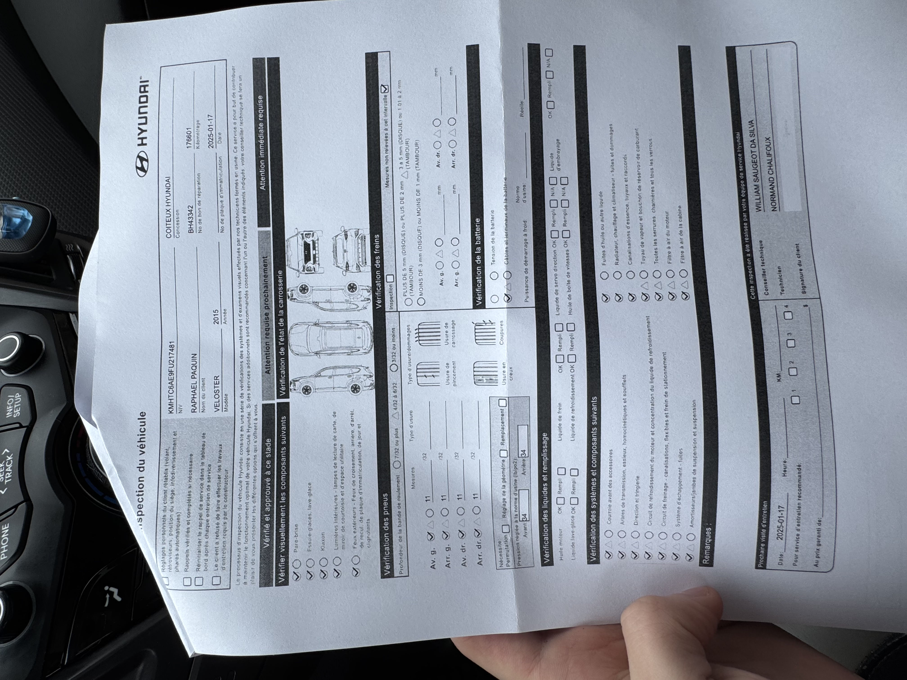
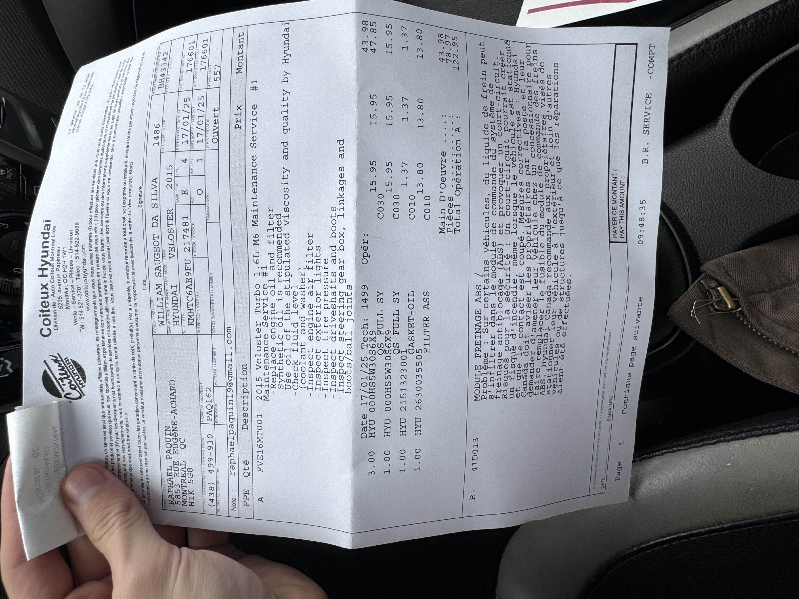
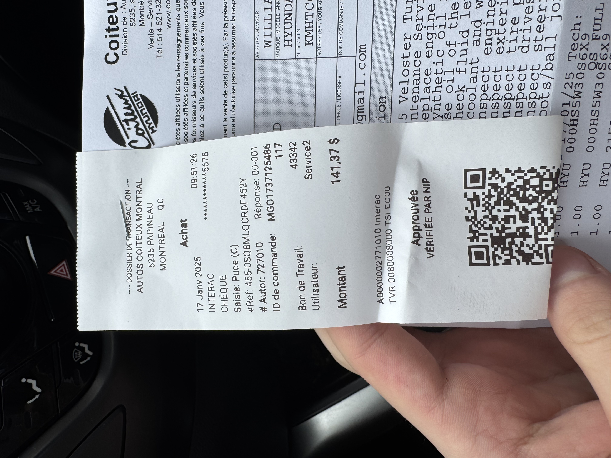

---
I did an oil change at the Hyundai Coiteux dealership. They also had the ABS system replaced for a recall. Told me it was just a fuse or something they had to replace. They also cleaned the exterior of the car (which didn't serve for much since it's already dirty). I also asked the clerk (which wasn't a mechanic might I add) if they did carbon cleaning since my car is GDI. He started rambling about how my car didn't need it and only newer cars did?? He was nice but I don't know if what he said was exactly true. Anyways here's the inspection and bill.

