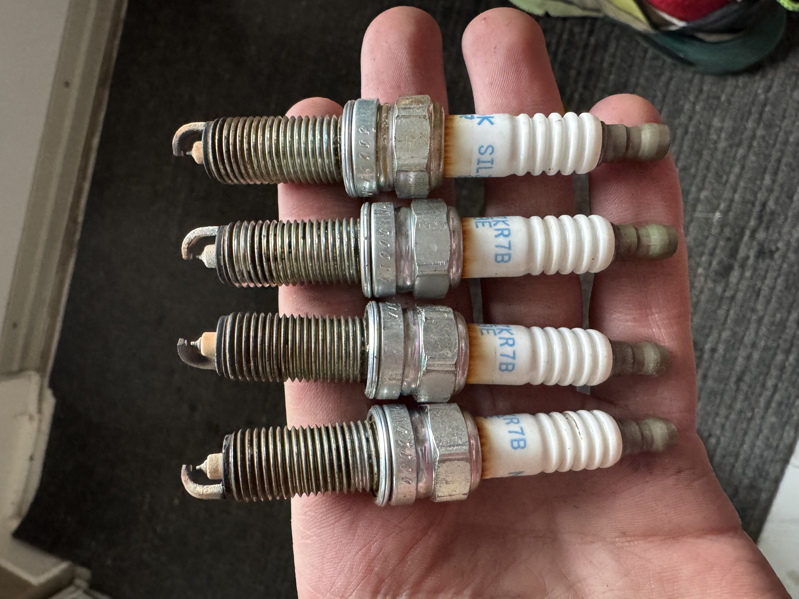

---

Replacing these was fairly simple ; 

After gapping all plugs to .28mm (I think)

1. Take off Coil Pack
2. Take extension and unscrew old spark plug from well
3. Cover hole with coil pack again (stop dust from going into engine)
4. cover ceramic section where boot covers with dielectric grease
5. Insert into socket and ratchet into engine (fudge torque spec)

I don't  have any photos of the new plugs but these are the old ones

*You can see the wear is mega un-even with the 1st and last plug being more worn. Should probably investigate cause.* 

The uneven wear would make engine rattle. After installation car runs much much smoother. I think what may be the cause of the rattling might be the engine running lean on certain cylinders. The reason I think this is, after getting carbon cleaned I immediately noticed that the engine was ticking fairly loud, or loud enough to be heard from the cabin. I got scared and had a meetup with Strasse Autowerks to check it out and also made a [reddit thread](https://www.reddit.com/r/veloster/comments/1i7d5zb/2015_veloster_turbo_rattle/). You can hear in the video in the thread that the noise comes from the driver side of the engine. Before inspecting the engine I looked up common cause for rattling/ticking and one was a failed timing chain tensioner. The issue is, the tensioner for the timing chain is on the passenger side of the engine (which is much quieter and thus ruled out). You can LITERALLY hear me at the end of the video say "OMG ITS THE INJECTORS". The engine is GDI so the injectors have to work harder and operate off of high pressure fuel injectors (which are louder). On the thread people have said that it's probably just normal injector noise. Even Strasse said this and said : "You just have a rattly interior your engine is fine lol". Despite all of this, I will still replace or at the minimum clean the injectors since if they haven't been replaced, they have a good amount of mileage on em and could probably be swapped. Also, the guy at Strasse said they, and I quote, "Hand washed the injectors" and "didn't ultra-sonic wash them". So yeah I could probably bet my left ass cheek that the reason for my engine shaking more than I can bear and having uneven spark plug wear is because of the dirty or used injectors. Something I'll have to see soon :)