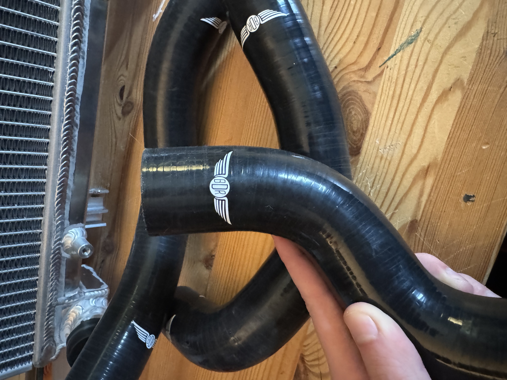
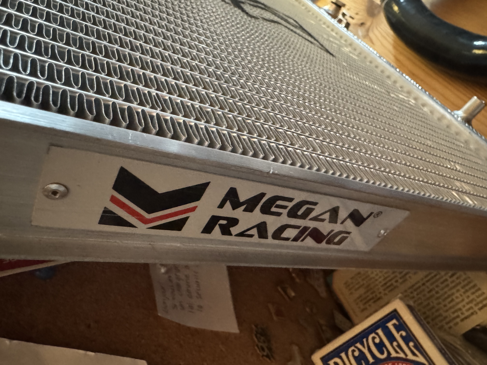
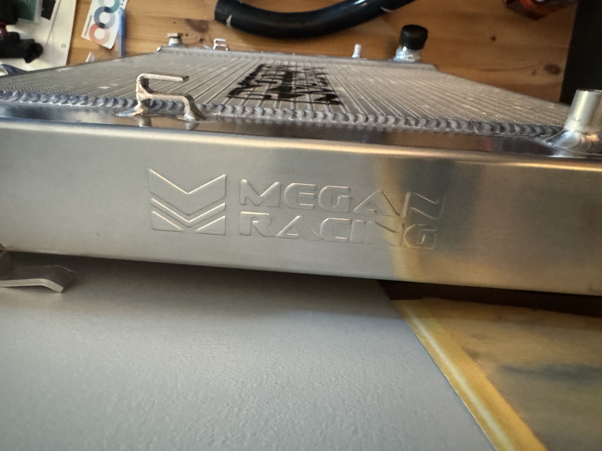
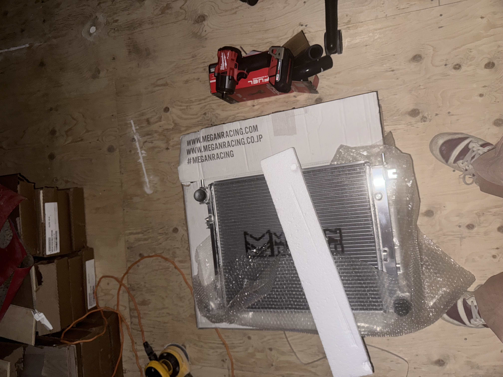

---

This will cover what I recently bought. I have a bunch of new parts and tools but have not installed them yet as I'm waiting to get some more parts first (will install everything at once). These are the things that I bought ;

## BUMPER SAG BRACKET
---

I cut in three a 48" steel bar that was 1/8" thick. I also bought all of the hardware and drill bits to make holes. More details on the install can be found in [[Bumper Sag]]. Also no fancy tools are needed for this other than like a drill and I got a 15$ metal hand saw to make two cuts along the steel plate.

## BDR RADIATOR COOLANT TUBING
---

From what I can tell these aren't even sold on KDM tuners anymore.

## MEGAN RACING RADIATOR
---

Super sexy radiator bought from boomer scammer with ugly ass kids bro was trying to take 15% of the sale we had agreed on bro is the market place police fuck that guy. He was cool other than wanting to hog my down payment money like bro thinks he's the IRS or something plus his daughter (a baby) looked like my pinky toe. 

## MILWAUKEE 2962-20
---

Don't have any pictures of this and it's too far for me to go fetch it but it's in this picture of all of the loot that I took the night I went to Ottawa to get everything. 

I want to install everything all at once as a big project only thing is I want to get my tires done and I also don't want to have parts laying around. I'd like to be under the car by mid-june. Only parts I need left for this project are :

- Serpentine Belt 30
- Water pump 60
- Coolant 30
- Spill-Proof Funnel 30
- Front Grill 120
- MAYBE lightweight pulley kit 400

Only thing is I have shit to pay for and tires so like. I might pass on lightweight pulley kit as that on its own would delay the changes as they're 400 DOLLARS GG. As for tools other than the spill proof funnel I may need wheel chocks, some (of my own) ratchets and sockets and maybe some impact sockets. As stated in BUILD ROAD TRIP, I'm getting ratchets tomorrow so no biggy but impact sockets are close seconds right now. Also also also, I really want to look at cosmos racing STS with a nice transmission fluid replacement and maybe also an interior detail. ALL IN ALL, LOTS OF WORK AHEAD BUT, LITTLE BY LITTLE, I'LL GET THERE AND HAVE FUN. NEXT UP THOUGH I REALLY NEED SOME RUBBER.
