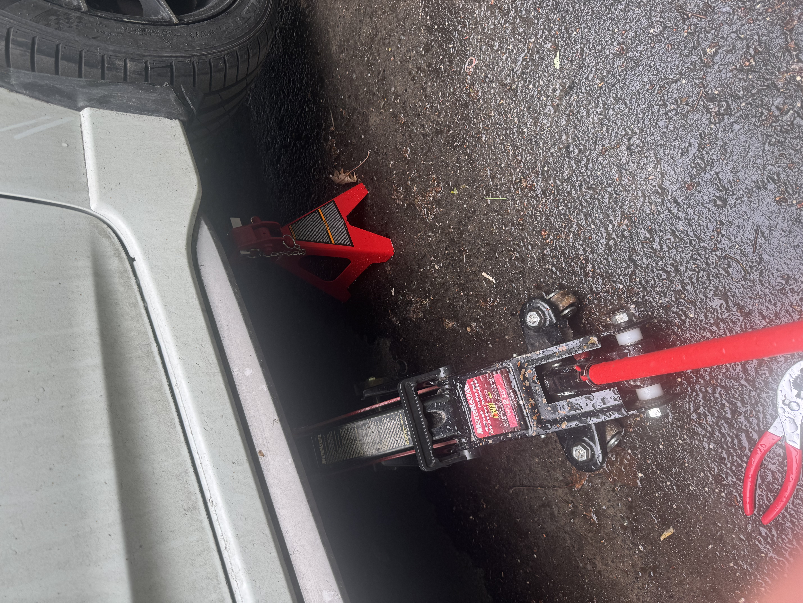
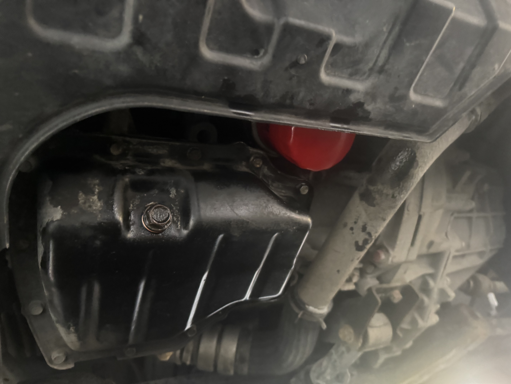
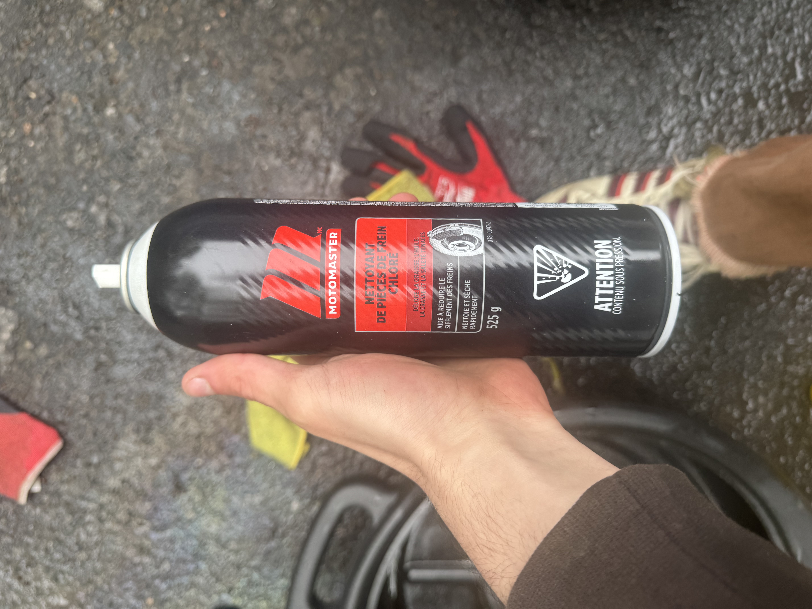
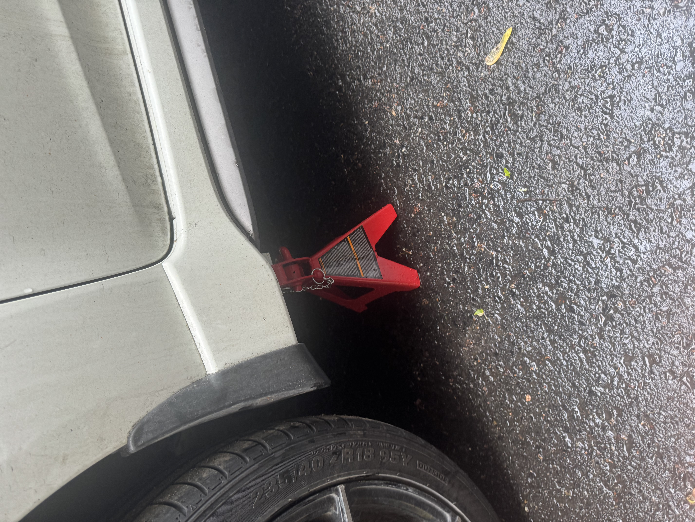
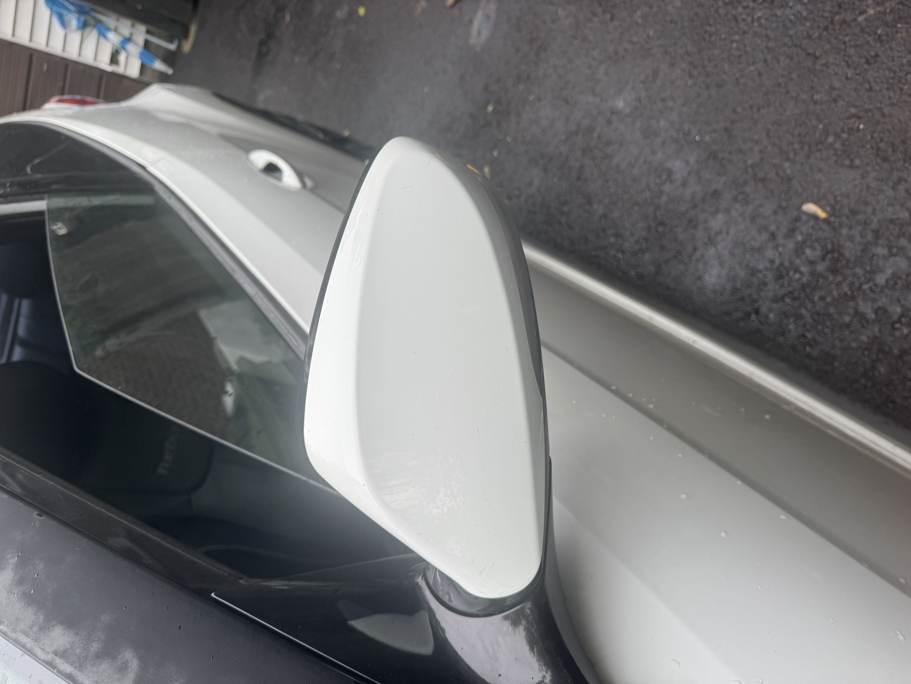
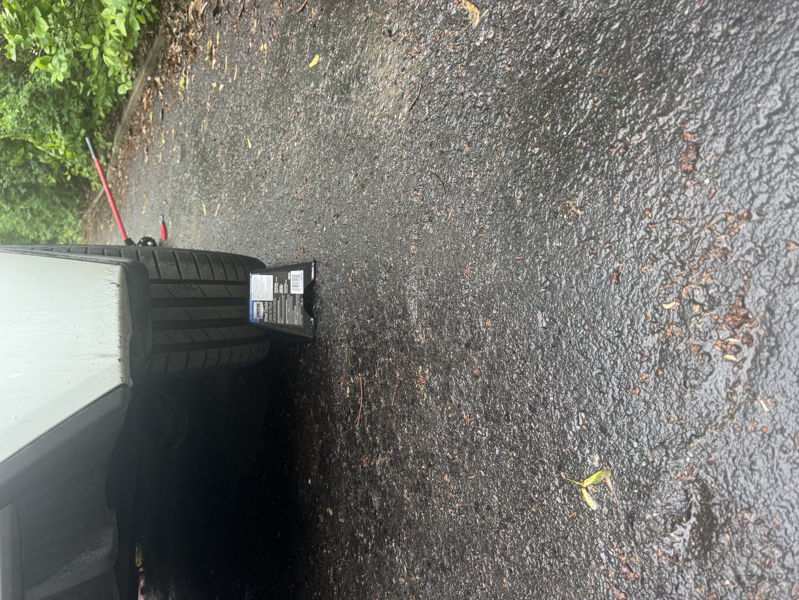
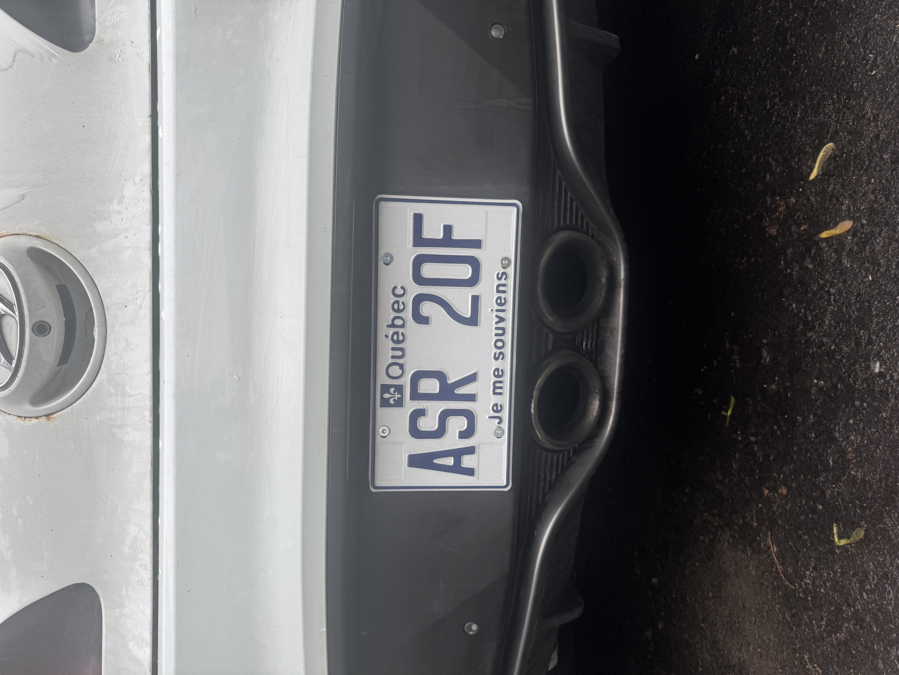

---

This issue has since been resolved but I was leaking oil from my oil filter. I bought some brake cleaner, chocs and lifted the car, drained the oil and checked. From what I could tell, it looked like there was a bunch of grime on the oil filter housing that may of been where the oil was escaping from. I cleaned the area, reinstalled everything and topped up the oil and I've been driving quite a lot and no oil has leaked since. Was cool to finally put my car on jack stands for the first time and to actually fix (somewhat) something on the car. I also took the time to remove the super old rusted screws on the license plate holder to some zinc ones. Also also, I cleaned the shit off of my mirror (my mirror was super dirty from PPF that I removed (oops)). The pictures are blurry there was oil on my phone.

