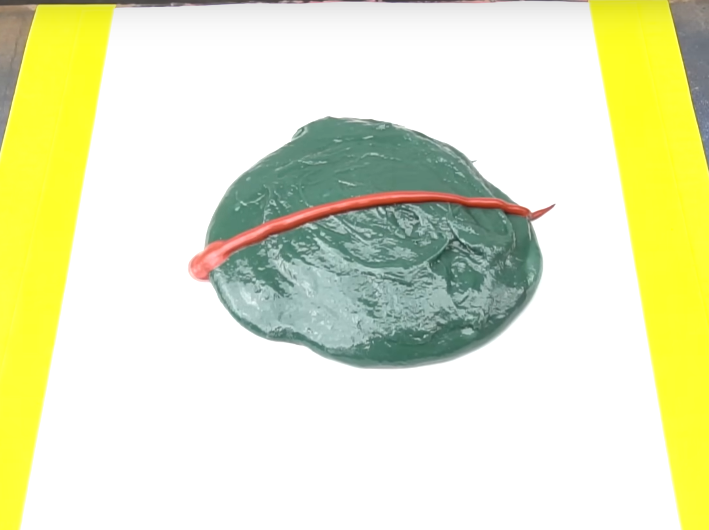
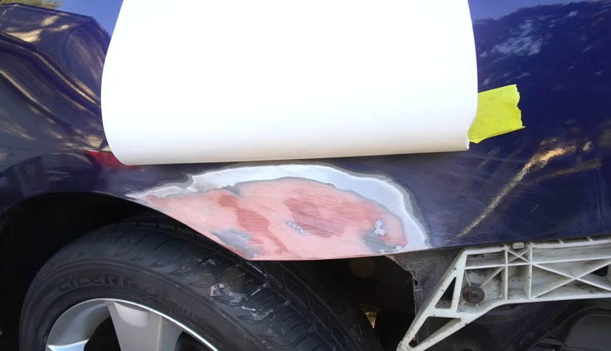

---

This is how to remove rust the ChrisFix way. I'll detail the overall steps as well as the parts and tools needed with provided links. For paint and clear coat you can find yours on this [link](https://www.paintscratch.com/)

**The 4 main steps are ;**

1. Remove Rust
2. Filler
3. Sand
4. Paint

**Tools/Parts needed :**

1. Alcohol/Adhesive remover
2. Sandpaper (40, 80, 180, 320, 600, 1500, 2000, 3000, 5000)
3. [Dust Mask](https://www.canadiantire.ca/en/pdp/3m-sanding-respirator-2-pk-0475837p.html?rq=dust+mask)
4. [Adhesive Body Patch](https://www.canadiantire.ca/en/pdp/bondo-self-adhesive-body-patch-0475813p.html?rq=body+patch)
5. [Bondo Glass (short strand reinforced **fiberglass filler**)](https://www.canadiantire.ca/en/pdp/bondo-glass-reinforced-filler-0475635p.html?rq=bondo+glass)
6. [Rust Reformer](https://www.canadiantire.ca/en/pdp/tremclad-rust-reformer-aerosol-spray-paint-flat-black-291-g-0489312p.html?rq=rust+reformer)
7. [Undercoating](https://www.canadiantire.ca/en/pdp/rubberized-rockerguard-undercoating-black-550-g-0477935p.html?rq=undercoating)
8. [Bondo Professional gold filler](https://www.canadiantire.ca/en/pdp/bondo-professional-gold-30-oz-0476501p.html)
9. [Hardener](https://www.canadiantire.ca/en/pdp/bondo-liquid-hardener-0475866p.html?rq=hardener)
10. [Paint (for my VT)](https://touchupshopcanada.ca) or [here](https://scratcheshappen.ca/touch-up-paint/?paint_type=1&paint_brand=30&paint_year=2015&paint_model=497#colors)
11. Clear Coat
12. [Glazing & spot putty](https://www.amazon.ca/3M-Pinholes-Scratches-Hairline-Fiberglass/dp/B0002JM8PY/ref=sr_1_6?crid=35IT7G3HYVW6U&dib=eyJ2IjoiMSJ9.zcXboQi9dr3xiqtbqt730udcFx5tfYjMeY7PwG5NpNdP12GEZvVZN-PZUsLjO1prI1IJX-hGWxf5GfujKbkaircyy6d8J1ZrJGC2liEyUkn7STE3X518FFyQ5Gzlbpixit_rPpRdHxnac_NAeshMuFIpSdgMgWvbt2QlGQEBE7SPTX_qooVBLNKOTthrUsrkT4iHMwrHCPjRn5WF21nroI5yqIRPWIfTNPNzgtc2VDTV6KbTnT-qTU2gogC7JIikdugXfjojLym8rq6GqMvUCCAuv3T_ACr2ajhHvkcUJoc.TzhyZYVOT95rT_oeQz3ItEbwrZbTs_uYnJFjyp2hVTE&dib_tag=se&keywords=Glazing%2B%26%2Bspot%2Bputty&qid=1748609681&sprefix=glazing%2B%26%2Bspot%2Bputty%2Caps%2C161&sr=8-6&th=1) 10\$~
13. [Filler Primer](https://www.amazon.ca/340g-Filler-Grey-Touch-Up-Primer/dp/B08286JT7P/ref=sr_1_1?crid=2BH4TSECQ9R5I&dib=eyJ2IjoiMSJ9.2I-s4fMzhpqcCl6dOTJWSTxieXNkO9AlE7EcRvzRUTELLozeiR0V5SseuKv4jLYq1nMEU_7tk_J-46N74Z3lYEHxpPVVUVLeU6VPGMLXvQq3QbUDk45uRj_3fMAXUebcHCgBI0tI2wMCxFwffDKjjeCUlg3UnZ8hcCohbgmJpSfRqd6YRTyScpueZy1d5EFAjd9DWoHXU86IddHj4oVCZdWqONrgkSLMTfTZxxB0IPpsLCACX6Nep5FMOhYwVYogDcy7MbL5QRdNPNifj57xOGNYn0TFDY69-H8mWa8O1QI.gvQp0EUiPyM4fN37mACLMbLh3E4iIxEoH9WQl_ZsZc4&dib_tag=se&keywords=bondo+primer&qid=1748609640&sprefix=bondo+prime%2Caps%2C108&sr=8-1) 15\$~
14. [Wool Pad](https://www.amazon.ca/Fasmov-Polishing-Buffing-Compound-Cutting/dp/B07RTGG9XK/ref=sr_1_10?crid=3JDBPIAOAL40B&dib=eyJ2IjoiMSJ9.EGvDWFotLSpof3XJ_xDPkVOQ8m5zmI6Mb1AcrLTS-P2cN0lUjp-DaG0bMyumJfvT7Z5u-NvS9K8C-GLos4NLvgQOgyttSHoF1Q-ILreclxq3bpO9YUF2gDFzMs0SuXVXlZ0CIBtdwVWXVeuUJJvGnlBZoXyZ-4sqRzHbyCypH9VTTP4cUQtMsZKSlgz6lOz-z5iqDBF9Rb-TuLj1c8NiZkwTaTLy7wRL9ny_6YVmlZiVe_DOl5wlT2izEjKUkEZDabuTJdT9mBKAXOx1rHgPOQunvigME6hC1c0ql7jtoFc.Y3wWNxlr2gUR_9Y9_mhJxfVrLuzFL0p2nWsaQbxpxw8&dib_tag=se&keywords=wool+pads&qid=1748610619&sprefix=wool+pad%2Caps%2C163&sr=8-10) 30\$~
15. Polisher 100-200\$~
16. [Wax](https://www.amazon.ca/Meguiars-G17216C-Ultimate-Compound/dp/B00F653IOO/ref=sr_1_7?crid=FHF89OPJZJSH&dib=eyJ2IjoiMSJ9.LN9cXu2Mz_CblC1k52Z9yrtnR6gg1M5bHCYwf_5wSTttAAWYyicKis9y6NcjqIpI6l64bm-ILvrV99aiGI3-Eg3BrA1FO7FgVjURTjN8asfRqH9y92_CySYCxmZaaDDYq5OkPN9TktUnXGiyXWNRLbxYE9XqBiHxs5eERLGO2C3mHCQ8xreWjNHXG0qcNvuq2GeYnGZj7qsUmXiSwAPOcdOa68qHZpYsU09QKKj4Tnv9UVe4nMbmO3ZqPV6DklAXcyZlkn1IKPzsaIjuNmMXw7wmxu05lhD6A7FhqAg0r60.1AndHTWcRj2GFV5lpyuiw34JBdEuUGPBr5yBt_pMF6c&dib_tag=se&keywords=car%2Bwax&qid=1748610708&sprefix=carwax%2Caps%2C133&sr=8-7&th=1) - 20\$~

**Instructions :**

**RUST**
1. Remove contaminants with alcohol
2. Put on dust mask and glasses
3. Get the bumper or other body panels out of the way and sand down to bear metal (80 grit)
4. Do the same to the backside of the body panel if accessible and necessary 
5. Once the back of the rust spot is sanded, Apply rust reformer, let dry and apply undercoating
6. Cut body patch to size and if necessary apply behind the body panel
7. Clean section with alcohol again and go to step 2

**FILLER**

1. Tape Parchment paper to box
2. Put a circle about half an inch tall of Glass Filler on paper
3. Lay out a bead of hardener across the circle
4. Mix 

5. Press Filler HARD against metal (doesn't need to look good)
6. Sand Filler until roughly aligned with body (40 grit)
7. Follow the same steps as before to prep the filler but with the Gold Filler + Mix
8. Apply gold filler to body as previously done with the glass filler

**SAND**

1. Sand down the gold filler until it matches the OEM shape of the body panel (80 grit)
2. Go down to 180 grit and continue smoothing out. Running fingers down the body panel should feel smooth.
3. Apply glazing putty in a super thin layer and let dry for 20 minutes
4. Sand down with 320 grit
5. Wipe the area down with alcohol

**PAINT**

1. Get Some paper ready to cover the existing paint around your rust spot like so (mask wheels if needed):

2. Follow the direction on the paint can and apply primer
3. Sand out the edges of the primer from the edges into the paint (600)
4. Whip out the paint can and spray on a first coat until the finish becomes matte. (light coat)
5. Repeat step 4 twice but slightly heavier (medium coat).
6. Put your clear coat in warm water and cover the painted area in a light coat.
7. Repeat step 6 twice but heavier medium coats.
8. Let cure for 48h

**FINAL STEP**

1. Wipe down area with microfiber towel and soap
2. Mask off areas you don't wanna sand
3. Wrap 1500 grit sandpaper around sponge and have it soak is some soapy water for a little bit
4. Start wet sanding the area in back and forth motions, going into the factory clear coat (long, non-circular strokes + entire panel) 
5. Same shit with 2000 grit (entire panel)
6. Same shit with 3000 grit and 5000 grit
7. Remove tape
8. Apply wax to a wool pad and hand buffer the wax over the entire panel.
9. On a low setting, buff the wax into the panel (don't press hard and do not stay over an area for long)
10. Wipe panel and voilà!